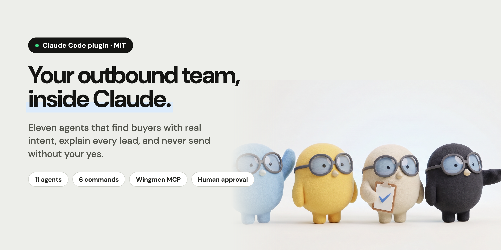
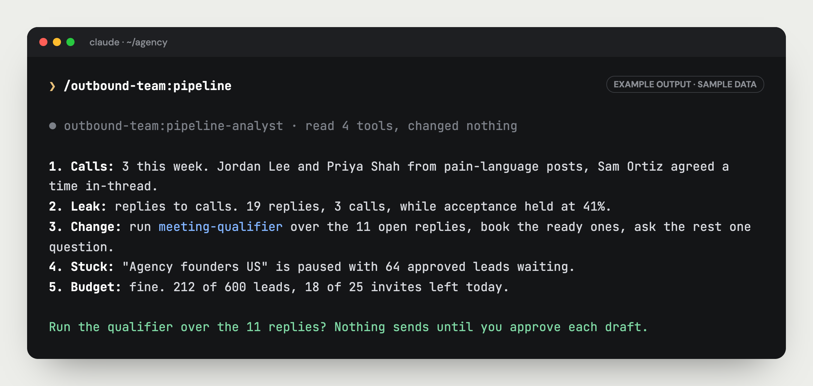

<p align="center"></p>

<p align="center">
  <a href="LICENSE"></a>
  
  
  
  
</p>

# Outbound Team for Claude

**Eleven agents that run your outbound from inside Claude.** They find people showing real buying intent, write a reason next to every lead, draft every message from a signal instead of a template, and work your replies until they become calls.

They never send anything you did not see first.

Built for founders who are still their own best salesperson and have no time left to prospect.

## Why this one

- **Every lead comes with a written reason.** Not "92 · high fit". A sentence you can check: *"Posted 6 days ago that their SDR left. Also hiring a BD role, listed 3 weeks ago."*
- **No signal, no message.** A job title is a filter, not a reason. If the agent cannot quote what the person said or did, the lead waits.
- **You approve everything that leaves.** Every send, launch, approval and targeting change is a preview first, and happens only after you say yes to that exact preview.
- **It protects your account.** LinkedIn's real limits, warm-up for new accounts, and a hard stop the moment something looks off. Your profile is your brand.
- **It works your replies first.** The money is in the inbox, so the daily loop starts there, not with more leads.

## Quickstart

```
/plugin marketplace add flywingmen/wingmen-outbound-team
/plugin install outbound-team@wingmen
/mcp            → Wingmen → Authenticate
/outbound-team:outbound-setup yourcompany.com
```

You need a [Wingmen](https://www.flywingmen.com) account (free trial) with your LinkedIn account connected in the app. Details below.

## What a session looks like

<p align="center"></p>

The weekly review in five lines: calls and where they came from, the one leak, the one change, what is stuck, the budget. It proposes the change. It does not make it.

## The team

| Agent | Job |
|---|---|
| **Head of Outbound** | Reads your workspace, prints a status board, picks the next move, routes the work |
| **Targeting Strategist** | Turns your website into who to hunt, and fixes it when the leads look wrong |
| **Signal Hunter** | Builds warm lists from the people commenting on a post, or from your own network |
| **Lead Judge** | Approves the real leads with a reason a stranger could check, dismisses the rest |
| **Account Researcher** | One honest angle per person: why them, why now. Says "no fresh trigger" instead of inventing one |
| **Copywriter** | Writes from the signal, under 80 words, and strips the AI tells |
| **Campaign Operator** | Creates agents, switches them on after your yes, runs hand-written campaigns, pauses anything at once |
| **Inbox Closer** | Works everyone waiting on you, drafts every reply, sends only what you approve |
| **Follow-up Agent** | Keeps warm threads alive: one nudge with something new, one close-out, then stops |
| **Meeting Qualifier** | Protects your calendar: book, ask one question, or pass |
| **Pipeline Analyst** | The five-line weekly review: what booked calls, where it leaks, the one change to make |

## How the work flows

```
Your website
   ↓  Targeting Strategist sets who to hunt
Lead Radar finds and scores people every day
   ↓  Lead Judge approves the real ones, each with a written reason
Approved list
   ↓  Campaign Operator creates a paused agent, you say yes, it goes live
Replies
   ↓  Inbox Closer drafts the answer, you approve, it sends
   ↓  Interested → Meeting Qualifier.  Warm but quiet → Follow-up Agent
Every Friday
   ↓  Pipeline Analyst tells you which source turns into calls
```

## Commands

| Command | Does |
|---|---|
| `/outbound-team:outbound-setup [website]` | Targeting from your site, shown before anything is saved |
| `/outbound-team:leads` | Work the queue: approve or dismiss, with reasons |
| `/outbound-team:warm-list [post or description]` | A warm list from a post's commenters or your connections |
| `/outbound-team:launch [list]` | An agent on an approved list, previewed, then switched on |
| `/outbound-team:inbox` | Who is waiting on you, with replies drafted |
| `/outbound-team:pipeline` | The weekly five-line review |

Or just talk to it: *"what should I do today"*, *"who replied"*, *"build a list from this post"*. The Head of Outbound routes it.

## A normal week

| When | Run | Time |
|---|---|---|
| Every morning | `inbox`, then `leads` | about 10 minutes |
| When you find a warm source | `warm-list`, then `launch` | a few minutes |
| Every Friday | `pipeline` | 5 minutes |

## Setup

**1. Before you start**

- A **Wingmen account**: sign up at [flywingmen.com](https://www.flywingmen.com) (free trial).
- Your **LinkedIn account connected inside the Wingmen app** (Accounts page). The agents work through connected accounts. They cannot connect LinkedIn for you, and nothing runs until one is connected.

**2. Install**

*Claude Code*

```
/plugin marketplace add flywingmen/wingmen-outbound-team
/plugin install outbound-team@wingmen
```

Then `/mcp`, pick **plugin:outbound-team:wingmen**, **Authenticate**, and sign in with your Wingmen account.

*Claude desktop or claude.ai*

Settings → Connectors → Add custom connector → `https://app.flywingmen.com/api/mcp`. Add `skills/outbound-team/` as a skill, or paste `SKILL.md` into a project.

*Codex, Cursor, Grok and other agent hosts*

Clone the repo into your project. `AGENTS.md` is the entry point and routes every request to the right agent. Add the Wingmen MCP from `.mcp.json` in your host's MCP settings. Grok can install it as a plugin from `.grok-plugin/`.

**3. Tell it about you**

Copy `icp-context.template.md` to `icp-context.md`: what you sell, who buys, who does not, the signal that matters, real proof, your voice, your booking link. Every agent reads it.

**4. Go**

`/outbound-team:outbound-setup yourcompany.com`

## FAQ

**Can it send something without me?**
No. Every action that sends, launches, approves or saves targeting is two steps: a preview with a signature, then the real call only after you approve that exact preview. If anything changes in between (someone replies), the signature fails and nothing happens.

**Will it get my LinkedIn account restricted?**
It is built not to. It runs on LinkedIn's real limits, warms up new accounts, prefers people you already know, and pauses first when something looks wrong. No tool can promise zero risk. This one refuses to trade your account for volume.

**Do I need Wingmen?**
To act, yes: finding and scoring people daily, sending, the inbox and the copy checks all run in Wingmen. Without it the agents still research and draft, and the playbook in `skills/outbound-team/` is yours to use with any tool.

**Why so strict about signals?**
Because a personalised message built on an invented signal is worse than no message. "NONE" is an allowed answer, and a thin true reason beats a confident wrong one.

**Can I change the agents?**
Yes. They are plain markdown files. Fork it, rewrite the rules for your market, keep the approval step.

## What is open and what is not

Everything in this repo is free and MIT licensed: the agents, the playbook, the scoring rubric, the copy rules, the commands. Read it, fork it, use the playbook without us.

The agents act through the **Wingmen MCP**, which is a paid product: Lead Radar, the LinkedIn sending engine with its safety limits, the inbox and the copy checks. There is a free trial at [flywingmen.com](https://www.flywingmen.com).

## Contributing

Pull requests welcome, especially new signals, sharper copy rules and better weekly reviews. See [CONTRIBUTING.md](CONTRIBUTING.md). Keep the three rules: approval before anything leaves, no signal no message, a written reason for every score.

If it books you a call, a star helps other founders find it.

---

MIT © Nemanja Milic · built with [Wingmen](https://www.flywingmen.com)
